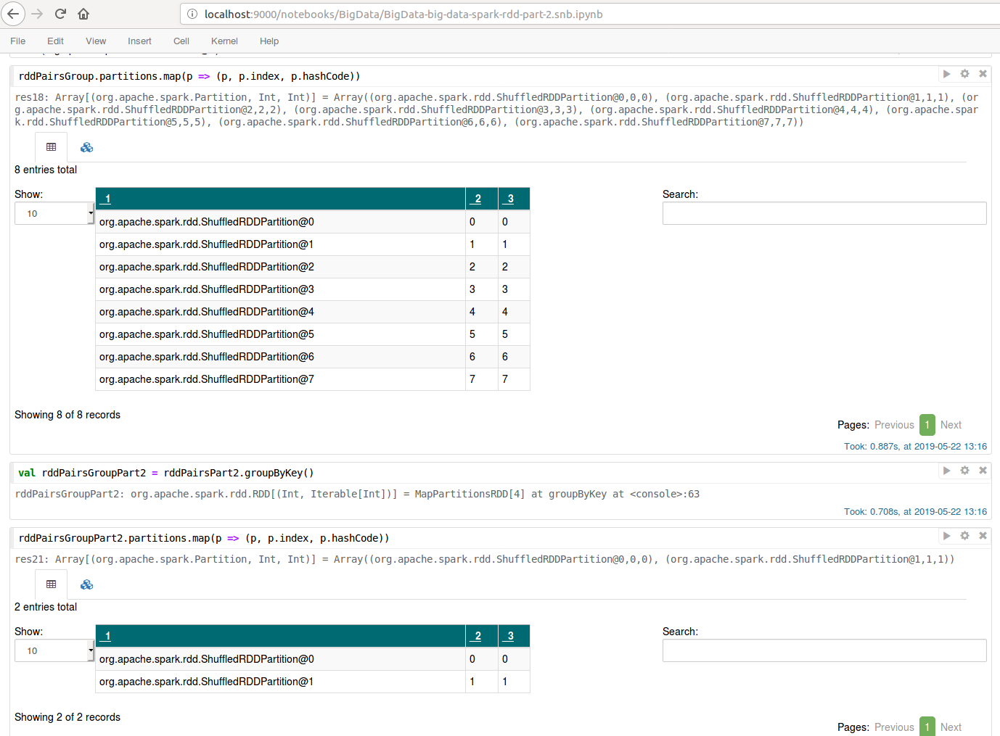

# Assignment 3A

## Introduction
Insight into Spark and notebooks

## Questions (chronological order)
**Q: Explain why there are multiple result files.**  
We have the result files part-00000 and part-00001. There are two files due to there being two RDD partitions. 

**Q: why are the counts different?**   
The first collect() done on 'Macbeth' gets the result 30. The second gets the result 285. The difference between these is  that some
preprocessing was made for the second one - 

`val words = lines.flatMap(line => line.split(" "))  
              .map(w => w.toLowerCase().replaceAll("(^[^a-z]+|[^a-z]+$)", ""))  
              .filter(_ != "")  
              .map(w => (w,1))  

              .reduceByKey( _ + _ )
`

so all the Macbeth-variations are counted instead of ones that are exactly and only written as 'Macbeth'. 

**Q: Spot the differences between the results, and try to map what you see on Chapter 2 that we read for the course.**  
The results are 

rddPairGroup has 8 partitions, and rddPairGroup2 has 2 - because this one was initialized as 
`val rddPairsPart2 = rddPairs.partitionBy(new HashPartitioner(2))`

Q: do you understand why the partitioner is none? (No worries if not, you will find a clue below.)
When we do the partitionBy(new HashPartitioner(x)) (like we did with val rddPairsPart4 = rddPairs.partitionBy(new HashPartitioner(4))) 
we get the result:

>Number of partitions: 4
>res40: Option[org.apache.spark.Partitioner] = Some(org.apache.spark.HashPartitioner@4)>
>
>Some(org.apache.spark.HashPartitioner@4)

The none-partitioner means no partitioner was assigned.

Q: Why are the results different for rddA and rddB? How is query processing affected by the partitioners?

Q: Compare the two query plans for rddC and rddD. Can you explain why the second query plan has on less shuffle phase?

Summarizing: partitioning depends on the distributed operations that are executed, and only operations with guarantees about the output distribution will carry an existing partitioner over to its result.
Another way to control the level of parallellism during query execution is to use the repartition and coalesce operations.

