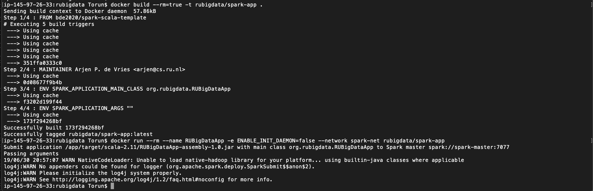

# Final assignment

## Introduction
The final assignment of the Big Data course of 2019 was a project where we were supposed use the data from a website crawl and perform some form of analysis on the data.

We were given a Spark Notebook to work off of, where we could do a local test of our code - and after that was working we were tasked to develop our own Spark Application and upload it to a local cluster where it would be run.

I faced many errors in this project, but in the end I did manage to run my Spark Application on the cluster (only - the localhost page didn't show anything?! But the terminal says it worked. More on this later)

## The Notebook and Warc
The provided Notebook gave examples of what we could do with the data in a warc file format. Running it with the suggested data from the instructions (data obtained by running the command `wget -r -l 3 "http://rubigdata.github.io/course/" --warc-file="course"` which produced the file `course.warc.gz`) worked fine. I was then supposed to find my own data to perform an analysis on - here's where things started going wrong. Uh oh. That was terrifyingly early in the process.

I picked a small part of a crawl done in May from the database of Common Crawls, and filtered for a website called bulbapedia.bulbagarden.net - this is a wikipedia type of page for the Pokémon franchise, which I am fond of and thought I might enjoy working with. I downloaded a warc-file of it by using the prefix `https://commoncrawl.s3.amazonaws.com/` in front of my crawl/data link, just like the instructions said, and placed it in the docker file system in the same folder as `course.warc.gz` file. Then I simply changed which file the Spark Notebook should load. Everything seemed fine and promising, until I ran the cells in the Notebook, and promptly got an error message in the cell '// WarcRecords corresponding to HTML responses:'. This is an exerpt of the error:

org.apache.spark.SparkException: Job aborted due to stage failure: Task 0 in stage 4.0 failed 1 times, most recent failure: Lost task 0.0 in stage 4.0 (TID 4, localhost, executor driver): java.lang.NullPointerException
	at $anonfun$3.apply(<console>:72)
	at $anonfun$3.apply(<console>:72)
	at scala.collection.Iterator$$anon$13.hasNext(Iterator.scala:463)
	at scala.collection.Iterator$$anon$11.hasNext(Iterator.scala:408)
	at scala.collection.Iterator$class.foreach(Iterator.scala:893)
	at scala.collection.AbstractIterator.foreach(Iterator.scala:1336)
	at scala.collection.generic.Growable$class.$plus$plus$eq(Growable.scala:59)
	at scala.collection.mutable.ArrayBuffer.$plus$plus$eq(ArrayBuffer.scala:104)
	at scala.collection.mutable.ArrayBuffer.$plus$plus$eq(ArrayBuffer.scala:48)
	at scala.collection.TraversableOnce$class.to(TraversableOnce.scala:310)
	at scala.collection.AbstractIterator.to(Iterator.scala:1336)
	at scala.collection.TraversableOnce$class.toBuffer(TraversableOnce.scala:302)
	at scala.collection.AbstractIterator.toBuffer(Iterator.scala:1336)
	at scala.collection.TraversableOnce$class.toArray(TraversableOnce.scala:289)
	at scala.collection.AbstractIterator.toArray(Iterator.scala:1336)
	at org.apache.spark.rdd.RDD$$anonfun$collect$1$$anonfun$12.apply(RDD.scala:945)
	at org.apache.spark.rdd.RDD$$anonfun$collect$1$$anonfun$12.apply(RDD.scala:945)
	at org.apache.spark.SparkContext$$anonfun$runJob$5.apply(SparkContext.scala:2074)
	at org.apache.spark.SparkContext$$anonfun$runJob$5.apply(SparkContext.scala:2074)
	at org.apache.spark.scheduler.ResultTask.runTask(ResultTask.scala:87)
	at org.apache.spark.scheduler.Task.run(Task.scala:109)
	at org.apache.spark.executor.Executor$TaskRunner.run(Executor.scala:345)
	at java.util.concurrent.ThreadPoolExecutor.runWorker(ThreadPoolExecutor.java:1149)
	at java.util.concurrent.ThreadPoolExecutor$Worker.run(ThreadPoolExecutor.java:624)
	at java.lang.Thread.run(Thread.java:748)
    etc..

Ok. Not great. I looked at the rubigdata forum where us students could ask questions about the project and found that other people had run into similar issues. We were adviced to use a smaller dataset (<1 GB), which might be hard to find on the Common Crawl website, or to get the data by doing our own wget on a website of choice.

"Let's do wget then", I said to myself, and ran wget on bulbapedia.bulbagarden.net. And it ran.. and ran. About 1.5 hours later, it still hadn't stopped running, and I realised, oh dear, this website is way too big to download this way. I cancelled the wget command. Out of curiosity I checked the size - it was 135411264 bytes. That's 135 MB. Interesting. I don't know why it was so inefficient - but this was clearly not the way forward.

I racked my brain for a smaller website. What could be small enough? It would have to be text based, I thought. Reddit? Hmm, a possibility, but I didn't have any idea of what to do with it. Nah. Maybe a forum of some sorts, but I haven't really been a big part of the forum world - no specific one came to mind.
A memory of text-based game guides came to mind, guides that I had used a lot when I was younger. Gamefaqs, that old beast. That could work. I found it logged on the Common Crawl from March 2019, got the warc-file (only 925 MB big! Perfect!) and put it into the Notebook. Finally, it would work!

...

It did not.

The same error message came up. I decided that the code in that malfunctioning cell wasn't very important anyway, and tried the cells below. The .take(x) commands resulted in the same type of error messages. Frustrating. They were, sadly, quite important for getting results.

Well. What was I supposed to do now? With no data, I couldn't develop code. With no code, I had no assignment. Okay, fine. Fine. It worked with our course page's Github Pages - I'll grab another Github Pages. I found one made by Twitter, and grabbed it using wget again. 

Guys. This time.. it actually worked with the Notebook!! I could cry. Hours wasted on this simple task but finally I had something. (And, going back to that 'hours' comment - I do mean *hours*. Plenty of them. And combined with just getting everything to run in the beginning, reading through all the instructions and trying to understand what was happening - I had spent some time with the project.)

Well, there was no time to get fancy with the analysis at this point. Remember that earlier assignment I had, where I used Spark to count how many times a word occurred? Yeah, I made the decision to implement that. I'm admittedly not that familiar with the coding language, Scala, anyway, nor have I coded a whole lot in the last two or three years or so, so this seemed like the most feasible approach.

The result can be seen in the code in the Notebook of course, and I found out that the most mentioned word was (perhaps unsurprisingly) 'the', which occurred 1774 times. 'twitter' was mentioned 119 times. See the toplist in the image below.

Moving on!

## Standalone Spark Application
Step 2 of this project was running our code in a cluster. For that, we had to make a standalone Spark Application. Following the instructions "Running Self Contained Apps on Hathi" worked sort of fine, but it gave a lot of errors as well. I had to do a lot of trial and error to get the `sbt package` to work. The sbt build file as it was gave me a lot of trouble as the packaging kept failing. After a lot of trial and error I ended up adding a library dependency for org.jsoup, and a second %-mark in the last line. You can see it here:

``
name            := "RUBigDataApp"
version         := "1.0"
scalaVersion    := "2.11.12"

val sparkV      = "2.4.1"
val hadoopV     = "2.7.2"
val jwatV       = "1.0.0"

resolvers += "jitpack" at "https://jitpack.io"

libraryDependencies ++= Seq(
  "org.apache.spark" %% "spark-core" % sparkV % "provided",
  "org.apache.spark" %% "spark-sql"  % sparkV % "provided",
  "org.apache.hadoop" %  "hadoop-client" % hadoopV % "provided",
  "org.jwat"          % "jwat-common"    % jwatV,
  "org.jwat"          % "jwat-warc"      % jwatV,
  "org.jwat"          % "jwat-gzip"      % jwatV,
  "org.jsoup"         % "jsoup"          % "1.8.2"
)

libraryDependencies += "com.github.sara-nl" %% "warcutils" % "-SNAPSHOT"
``

While succinct in this text, I think it took me about seven (7) hours to get the application to work in the end.

Running the last two commands, `docker build --rm=true -t rubigdata/spark-app .` and `docker run --rm --name RUBigDataApp -e ENABLE_INIT_DAEMON=false --network spark-net rubigdata/spark-app` gave me the output:

